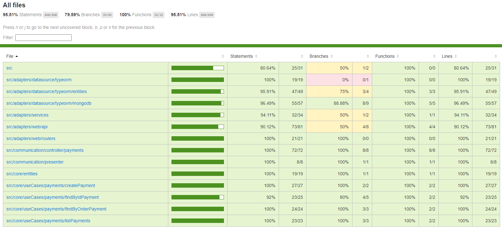
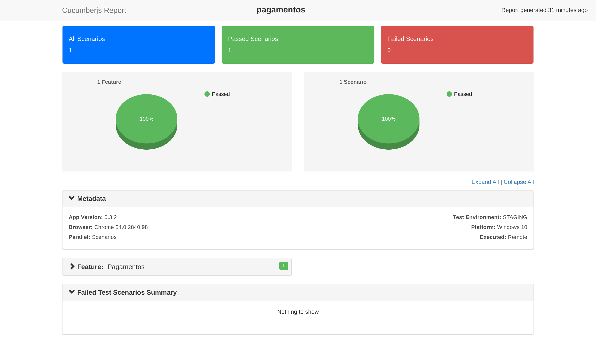

# Micro serviço pagamentos de pedidos  

Projeto desenvolvido para gerenciar os pagamentos do sistema de pedidos de uma lanchonete utilizando os conceitos de Arquitetura Limpa (Clean Architecture)

## 1) Contexto da aplicação

Ao ocorrer o pagamento do pedido, este micro serviço irá enviar uma alteraçao de status do pedido no micro servico [ms-orders-service](https://github.com/devair/ms-orders-service)

## 2) Documentos

### a) Relatório de testes unitários

[Relatório de cobertura em Html](.static/coverage-report.html)

### b) Relatório de BDD
[Relatório de testes BDD no Cucumber em Html](./static/cucumber-report.html)

 

## 3) Sonarqube

[Análise no Sonarqube](https://sonarcloud.io/summary/overall?id=devair_ms-payments-service)

## 4) Rodar localmente no Docker for Windows

Para executar a aplicação é necesssário ter o Docker instalado localmente com o Kubernetes ativado

### a) Clonar o projeto 

~~~bash
  git clone https://github.com/devair/ms-payments-service.git
~~~

### b) Acessar o diretório do projeto

~~~bash  
  cd ms-payments-service
~~~

### c) Rodar no Docker

### 
~~~bash  
docker compose build && docker compose up
~~~  

### d) Verificar o estado da aplicação
Executar o comando abaixo no prompt e obter o retorno 'Ok' indicando que a aplicação está em execução

~~~bash
curl http://localhost:3334/health
~~~

## 5) Utilização da aplicação

Para utilizar a aplicação precisa-se seguir a sequência de chamadas de APIs abaixo.

### a) Inclusão de pagamento para um pedido

Utilizar a API abaixo para inclusão de pagamento para um pedido.

Utilizar a data no formato: "yyyy-MM-ddThh:mm:ss"

POST http://localhost:3334/api/v1/payments

Content-Type: application/json

Body Request:
~~~json
{
    "orderId": <ORDER ID>,
    "paymentDate": "<PAYMENT DATE>",
    "paymentUniqueNumber": "<PAYMENT UNIQUE NUMBER>"
}
~~~

Response Status Code: 201

Body Response:
~~~json
{
    "id": <PAYMENT ID>,
    "orderId": <ORDER ID>,
    "amount": <PAID AMOUNT>,
    "paymentDate": "<PAYMENT DATE>",
    "paymentUniqueNumber": "<PAYMENT UNIQUE NUMBER>"
}
~~~

