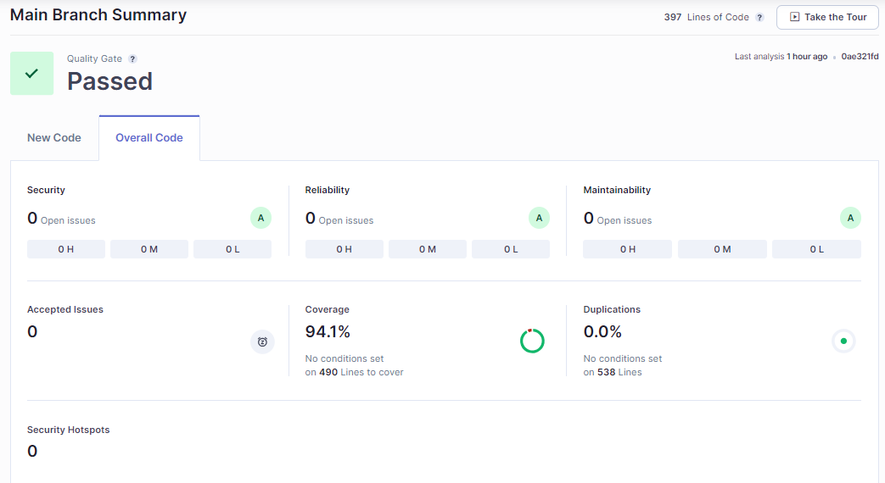

# Micro serviço pagamentos de pedidos  

Projeto desenvolvido para gerenciar os pagamentos do sistema de pedidos de uma lanchonete utilizando os conceitos de Arquitetura Limpa (Clean Architecture)

## 1) Contexto da aplicação

Ao ocorrer o pagamento do pedido, este micro serviço irá enviar uma alteraçao de status do pedido no micro servico [ms-orders-service](https://github.com/devair/ms-orders-service)

## 2) Documentos

### a) Relatório de testes unitários

[Relatório de cobertura em Html](./static/coverage-report.html)

### b) Relatório de BDD
[Relatório de testes BDD no Cucumber em Html](./static/cucumber-report.html)

 

## 3) Sonarqube

[Análise no SonarCloud](https://sonarcloud.io/summary/overall?id=devair_ms-payments-service)

## 4) Utilização do micro serviço

### a) Aprovação de pagamento para um pedido

Utilizar a API abaixo para inclusão de pagamento para um pedido.

Utilizar a data no formato: "yyyy-MM-ddThh:mm:ss"

PATCH http://localhost:3334/api/v1/payments/approve/<PAYMENT_ID>

Content-Type: application/json

Body Request: 
~~~json
{
    "paymentDate": "<PAYMENT DATE>",
    "paymentUniqueNumber": "<PAYMENT UNIQUE NUMBER>"
}
~~~

Response Status Code: 200

Body Response:
~~~json
{
  "orderId": <ORDER_ID>,
  "amount": <ORDER_AMOUNT>,
  "createdAt": <CREATED_DATE>,
  "status": "Aprovado",
  "paymentDate": <PAYMENT_DATE>,
  "paymentUniqueNumber": <PAYMENT_UNIQUE_NUMBER>,
  "id": <PAYMENT_ID>,
  "reason": <REASON>
}
~~~

### b) Rejeição de pagamento para um pedido

Utilizar a API abaixo para rejeição de pagamento para um pedido.

PATCH http://localhost:3334/api/v1/payments/reject/<PAYMENT_ID>

Content-Type: application/json

Body Request: 
~~~json
{
   "reason": "no reason"
}
~~~

Response Status Code: 200

Body Response:
~~~json
{
  "orderId": <ORDER_ID>,
  "amount": <ORDER_AMOUNT>,
  "createdAt": <CREATED_DATE>,
  "status": "Rejeitado",
  "paymentDate": <PAYMENT_DATE>,
  "paymentUniqueNumber": <PAYMENT_UNIQUE_NUMBER>,
  "id": <PAYMENT_ID>,
  "reason": <REASON>
}
~~~

